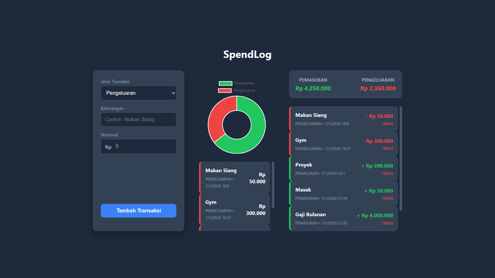

# SpendLog (Vanilla JS)

A web-based application to track daily income and expenses efficiently. This project serves as my **starting point** in mastering the JavaScript ecosystem, moving from core logic/DOM manipulation to modern modular architecture and data visualization.



## About SpendLog

SpendLog was built to solve a simple problem: recording where money goes. However, the main goal behind this project is **educational**. I challenged myself to build a functional CRUD application using **Pure JavaScript** without initially relying on frontend frameworks like React.

In the latest update, I have refactored the codebase to use **ES6 Modules** and integrated **Chart.js** for real-time financial visualization.

### Key Features
* **Transaction Recording:** Add income or expense details easily.
* **Interactive Visualization:** A dynamic Doughnut Chart that visualizes Income vs. Expenses.
* **Smart Filtering:** Click on the chart sections (Income/Expense) to filter the transaction list below automatically.
* **Real-time Calculation:** Automatically calculates total balance and summary.
* **Data Persistence:** Uses browser `localStorage` so data remains safe even after refreshing.
* **Currency Formatting:** Auto-format numbers to Indonesian Rupiah (IDR).
* **Responsive UI:** A balanced layout that works on Desktop and Mobile.

## Transparency & Learning Process

In the spirit of honesty and open-source learning, I want to be transparent about how SpendLog was built:

* **The Logic (100% Me):**
    All the JavaScript logic, including data processing, array manipulation (`map`, `filter`, `reduce`), and the transition to **ES6 Modules**, was written by myself. I also implemented the logic to connect Chart.js interactions with the DOM.
* **The UI/UX (AI-Assisted):**
    To ensure the application looks professional, I utilized AI assistance (Gemini) to help design the CSS architecture (Twin Box Layout, Dark Mode aesthetics). This allowed me to focus my learning energy on the JavaScript logic while producing a polished result.

## Tech Stack

* **HTML5** - Semantic structure.
* **CSS3** - Flexbox, Responsive Design, Dark Mode.
* **Vanilla JavaScript (ES6+)** - Core logic, Event Handling, DOM Manipulation.
* **ES6 Modules** - Modular code structure (`import`/`export`).
* **Chart.js** - Data visualization library.

## Future Roadmap (Scalability Plan)

I have a structured plan to scale this application into a full-stack product:

* **Phase 1:** Solidify Vanilla JS logic and LocalStorage. ✅
* **Phase 2:** Integrate **Chart.js** for visualization & Refactor to **ES6 Modules**. ✅
* **Phase 3 (Next Up):** Migrate from `localStorage` to a real backend using **Node.js & Express.js**.
* **Phase 4:** Implement **MongoDB/MySQL** to store user data permanently.
* **Phase 5:** Rebuild the User Interface using **React.js** for better state management.

## How to Run

1.  Clone this repository:
    ```bash
    git clone [https://github.com/yourusername/spendlog.git](https://github.com/yourusername/spendlog.git)
    ```
2.  Open the folder in your code editor (e.g., VS Code).
3.  **Important:** Since this project uses ES6 Modules, it is recommended to run it using a local server (like "Live Server" extension in VS Code) to avoid browser security restrictions.

---

**Created by Muhammad Irham Hadi Putra**